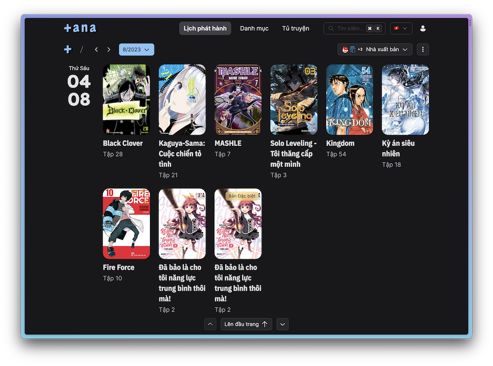

<p align="center">

</p>

<p align="center">
<a href="https://tana.moe/">Homepage</a> | <a href="https://blog.tana.moe/">Blog</a>
</p>

kikuri (hiroi) is a Nuxt-based front-end for [momoka-lite](https://github.com/tanamoe/momoka-lite), using [arisu](https://github.com/tanamoe/arisu) container in production.

Look at the [Nuxt 3 documentation](https://nuxt.com/docs/getting-started/introduction) to learn more.

## Get Started

<p align="center">

</p>

Define some required variable in the project `.env` file, including:

```
POCKETBASE_URL=
SITE_URL=
BLOG_URL=
OG_URL=
```

## Setup

We use [Bun](https://bun.sh) for managing dependencies instead of pnpm/npm/yarn. Currently, Node.js is still needed for building and running the application, as Bun's runtime is not stable (for Nuxt) yet.

Install the dependencies:

```bash
bun install
```

## Development Server

Start the development server on `http://localhost:3000`

```bash
bun run dev
```

## Production

Build the application for production:

```bash
bun run build
```

Locally preview production build:

```bash
bun run preview
```

Check out the [deployment documentation](https://nuxt.com/docs/getting-started/deployment) for more information.
